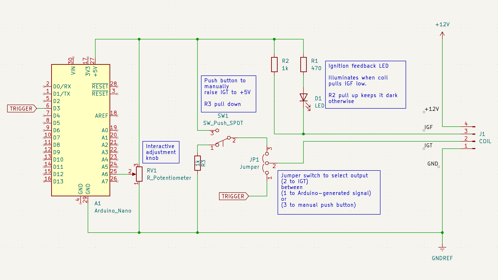

# Ignition Coil
Experiments driving a Toyota Sienna electronic ignition coil

* [`coil_test`](./coil_test/): Arduino Nano sketch to send pulses

* [`coil_test_circuit`](./coil_test_circuit/): KiCad schematic of coil test circuit board

* [`oscilloscope_lead_acid_battery`](./oscilloscope_lead_acid_battery/): A set
of oscilloscope traces of lead acid battery voltage while it provided power
for my coil test circuit.  don't understand what these signals represent.

