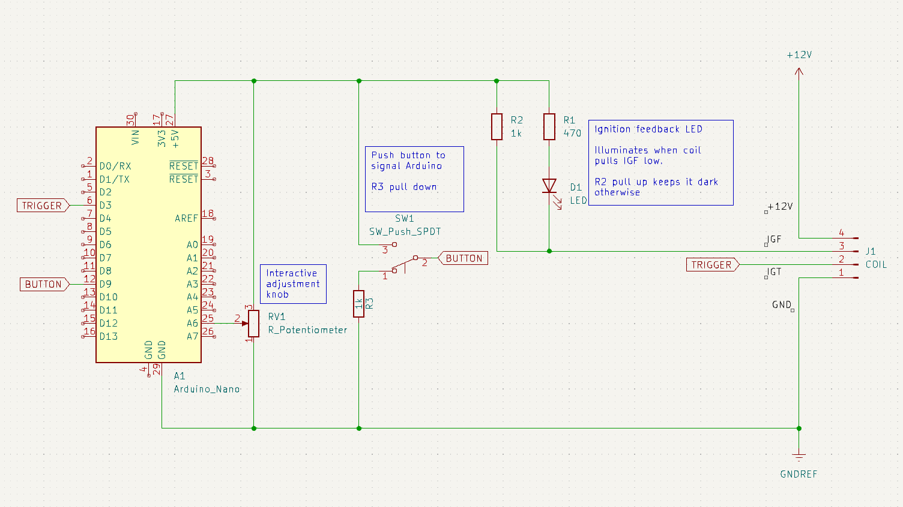

# DANGER HIGH VOLTAGE

## A vehicle's ignition coil generates high voltage and must be treated with respect. Anyone who didn't already know this should probably close this browser tab and go look at a different project

This repository holds files supporting experiments driving a Toyota Sienna
electronic ignition coil. Details can be found in the project notes starting
from this page:
https://newscrewdriver.com/2024/06/08/toyota-sienna-denso-coil-on-plug-module/

**Update:** Most of the stuff below turned out to be unnecessary: it turns
out the easiest thing to do is drive the coil's IGT pin with Arduino `tone()`
and music follows. See https://hachyderm.io/@regorlas/112606102223651729

---

* [`coil_test`](./coil_test/): Arduino Nano sketch to send pulses

* [`coil_test_circuit`](./coil_test_circuit/): KiCad schematic of coil test circuit board

* [`oscilloscope_lead_acid_battery`](./oscilloscope_lead_acid_battery/): A set
of oscilloscope traces of lead acid battery voltage while it provided power
for my coil test circuit. I don't understand what these signals represent.

* [`danger_organ_circuit`](./danger_organ_circuit/): KiCad schematic of coil
test circuit board modified for danger organ sketch. The jumper was removed,
Arduino D3 is directly wired to IGT, and the "manual ignition" button was
redirected to Arduino D9 to toggle between "engine" and "playback" modes.

* [`danger_organ`](./danger_organ/): Arduino Nano sketch that launches into
(1) engine emulation mode, simulating range of engine speeds with potentiometer,
and with a push of the button switch to (2) playback mode, performing
_Ode to Joy_ from Beethoven's Symphony No. 9

* [`midi note to frequency to period.xlsx`](./midi%20note%20to%20frequency%20to%20period.xlsx):
Excel spreadsheet to convert MIDI notes to frequency to time period I need to
wait between spark pulses.